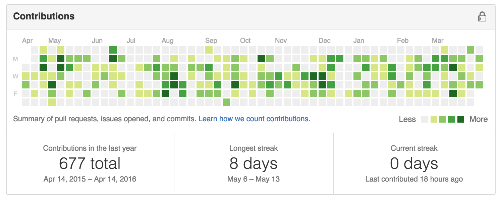

# Emanuel de Souza 
Software Engineer in love with design patterns, test driven development, process automation and sci-fi movies. Nonstop learner and problem solver with hands-on style.

## About me
31, Married, father of two beautiful daughters. Passionate with programming, robotics, IoT, process automation, learning new things, languages and different cousines. Reads a lot from internet and kindle, watch to sci-fi and fantasy movies, classic series, health & food documentaries and animes. Plays playstation with his kids and listen to J-Rock, Nu Metal and Rock.
Fullstack Developer, lives in Florianópolis (Brazilian Sillicon Valley).

* Email: [emanuelcds@gmail.com](mailto:emanuelcds@gmail.com)
* Github: [github.com/emanuelcds](http://github.com/emanuelcds)
* LinkedIn: [linkedin.com/in/emanueldesouza](https://www.linkedin.com/in/emanueldesouza)
* Twitter: [@emanuelcds](http://twitter.com/emanuelcds)

## Programming Skills
* Javascript (High Skilled): AngularJS, Angular-UI, ngResource, NodeJS, Express, socket.io, Mongoose, Jasmine, Mocha and Karma (and a little bit of WebRTC API).
* Python (High Skilled): Django, Flask, Tastypie, Tornado, Celery, Nose, Fabric and SCons.
* Shellscript (High Skilled).
* C/C++ (High Skilled): SDL, Boost, Qt, GTest with CMake Projects. Embedding Python with libboost.python.
* Ruby (Average): Ruby on Rails 3, Sinatra, MongoMapper and Padrino. (Some experiments with rubinius and FFI)
* Java (Average): Servlets, JSP, Hibernate, OpenJPA, Jersey, Jongo, JUnit, Swing, Ant and Maven.
* PHP (Average): Composer, PDO, SlimFramework.

## Additional Knowledge
* Database Modeling and Tunning in PostgreSQL and MySQL
* Sharding and Replica Sets with MongoDB
* Continuous Integration with CircleCI, Jenkins and TeamCity
* Lynckia Licode (C++ WebRTC Server and JS API)
* Game Development with SDL, DirectX, OpenGL, WebGL, Unity, Godot, PyGame and Unreal Development Kit.
* Infrastructure Scaling with Amazon AWS: RDS, EC2, Route53, SNS, SES, S3, ELB and AutoScale Groups.

## Opensource Contributions
The list of opensource project I had contributed.
- [Gunicorn](https://github.com/) - Bug reporter and benchmarking tests for gunicorn web container for wsgi applications.  
- [Marimba POS] (https://github.com/emanuelcds/marimba-pos) - Opensourced the Marimba point of sale software developed with Ionic Framework.  
- [Asset Bundle] (https://github.com/emanuelcds/assetbundle) - Open comunity to find talents to develop assets for your games.  
- [Circle CI Github Submodules] (https://github.com/emanuelcds/circle-github-submodules) - Integration of multiple github hosted submodules to trigger builds on the main project at circle-ci.  
- [Django Tenant Schemas] (https://github.com/bernardopires/django-tenant-schemas) - Multi tenancy support for Django using PostgreSQL schemas.  
- [Angular Country Picker] (https://github.com/contentools/angular-country-picker) - AngularJS directive to generate a list of countries as options of the select element.  

## Contribution Status
This is the sum of my contribution status counting opensource and private projects from Apr 14th 2015 to Apr 14th 2016.

## Projects
This is the list of project I have developed in the last five years. This list is frequently updated.

### Contentools Platform
Contractor: [Contentools](http://contentools.com) (Co-founder and CTO)  
> All in one content marketing platform that delivers the best experience in content production, custom workflows, content production, team management, custom roles
> and publishing automation.  

Tech Stack: AngularJS, Bootstrap, Django, Tastypie and Multi-Tenant achitecture using PostgreSQL Schemas.  
[Contentools Platform](https://go.contentools.com/signup)

### Marimba Gaming Pull-Tabs System
Contractor: Self-Employed (Co-founder)
> Video Lottery system developed aiming the Alaska, Virginia and Minnesota markets. Developed game math sheets (probabilitics), games, game lobby, Point of Sale and REST API.  

Tech Stack: Godot Engine for the Games, Python with SciPy and Google Spreadsheets for Game Mathematics and Probabilistics, Python with Django and Restless for Point of Sale and Game REST API,
AngularJS + Ionic + Apache Cordova for Point of Sale cross mobile and web version and Django Admin customizations for Administration Panel.  
[Marimba Gaming](http://marimbagaming.com)  
[Point of Sale](http://pulltabs.easylogic.com.br/)  
[Admin Panel](http://pulltabs.easylogic.com.br/panel)  
[HTML5 Games](http://comming.soon.html5.version)  

### GameScope
Contractor: Self-Employed (Co-founder)
> Besides it is a proof of concept in progress, the system targets to capture sensitive data of
user behavior, monitoring metrics and screen actions, assisting decision making in games for 
Online casinos, VLT and Class II games.  

Tech Stack: Pure Javascript for monitoring canvas render context and pushing events, ffmpeg for video encoding, Direct3D and OpenGL for gathering context buffers
on standalone games, AngularJS with ngMaterial for the metrics and statistics panel, Django 1.9 and Django Channels for realtime communication.  
[GameScope Website](http://gamescope.co)  

### Konviva LMS
Contractor: [iLog Technology](http://ilog.com.br)
> Learning management system built by iLog to assist corporate universities and online courses in brazilian market. Developed the conference room system for online realtime chat and presentations.  

Tech Stack: Javascript, Java and C++ with AngularJS, Bootstrap, NodeJS, Express, Socket.IO, Lynckia Licode, WebRTC API, Mongoose and SpringMVC.  
[Konviva LMS](http://konviva.com.br)

### Email Manager
Contractor: [eCentry Technologies](http://ecentry.com.br)
> Email marketing and massive mailing dispatcher SaaS platform. Currently called Maildocker.

Tech Stack: AngularJS, Django, Tastypie and Django-Celery with RabbitMQ for asynchronous email delivery.  
[Maildocker](http://maildocker.com)

### Shake and Stir
Contractor: [Side Games Ltd](http://sidegamesltd.com)  
> Game and Server made for SideGames Ltd, an Israel based company with business in USA Gaming market.  

TechStack: Javascript and PHP with WebGL Shaders, PlayCanvas Framework, SlimFramework, PDO and MySQL.  
[Shake and Stir Lobby](http://www.sidegamesltd.com/games/lobby.php)  

### NorthStar Gaming Platform
Contractor: [Vesta Incubator](https://vestaincubator.com)  
> VLT platform for Minnesota. Requirements extracted from Gambling Comission Board regulations.
> Developed a set of tools to operate Electronic Linked Bingos and Electronic Pull Tabs, including 
> one bingo game, a point of sale and the back office for software distributors.  

TechStack: ActionScript 3 and Starling for the games, Objecte-C and Cocoa Touch for Point of Sale software, Ruby and Sinatra with some FFI calls in C and MongoDB for the API Endpoints and 
Ruby on Rails 3 with PostgreSQL and Devise for Software Distributor's Web Panel. Server scaling and task automation with Python, Fabric, Shellscript and Puppet.  
[NorthStar Gaming FB Page](https://www.facebook.com/nstargaming/)  

### Halo and Frontier Platforms
Contractor: [Vesta Incubator](http://vestaincubator.com)  
> Sweepstakes and Class III Casino Platforms for Tampa County, North Carolina, Florida and LATAM markets.

TechStack: Proprietary engine developed in C++ with OpenGL/OpenAL and embedded Lua, GameServer
developed with C++, ZeroMQ, QT Framework 4.8 and LibBoost, MySQL for Local Servers and Postgres for
remote servers. Point of Sale solution developed in C++ with QT Framework and QML. Hardware integration
for casino input system (Hardware Buttons, I/O and Tampering Detection), Proprietary OS developed
over Linux kernel and Ruby on Rails for NOC and Web Reporting panels.  
[Videos of Games Running](https://www.youtube.com/user/VestaIncubator2013)  

### EXOS - The Experience Operating System
Contractor: [Sábia Experience](http://sabiax.com.br)  
> Software Development Kit to create games and interactive experiences using javascript, flash, C# and
python running over EXOS system (developed by Sabia Experience).  

TechStack: C for Embedding mono and python runtimes, C++ with QT Framework and embedded webkit to
create the cross-platform app simulator shell, Javascript and ActionScript 3.0 to create the stubs
for calling the internal API developed in C++.  
[Sabia Experience Website](https://sabiax.com.br)  

